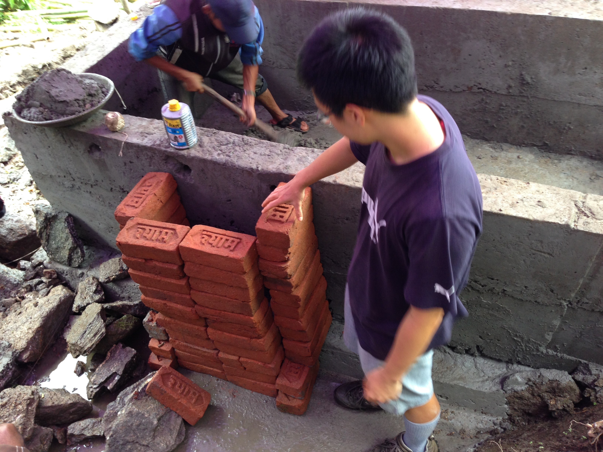
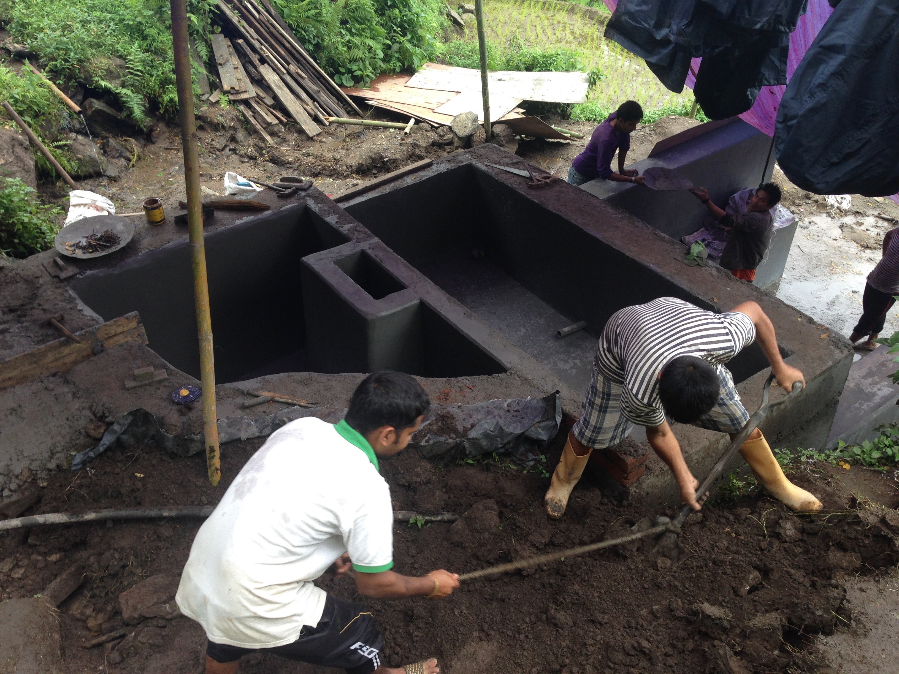
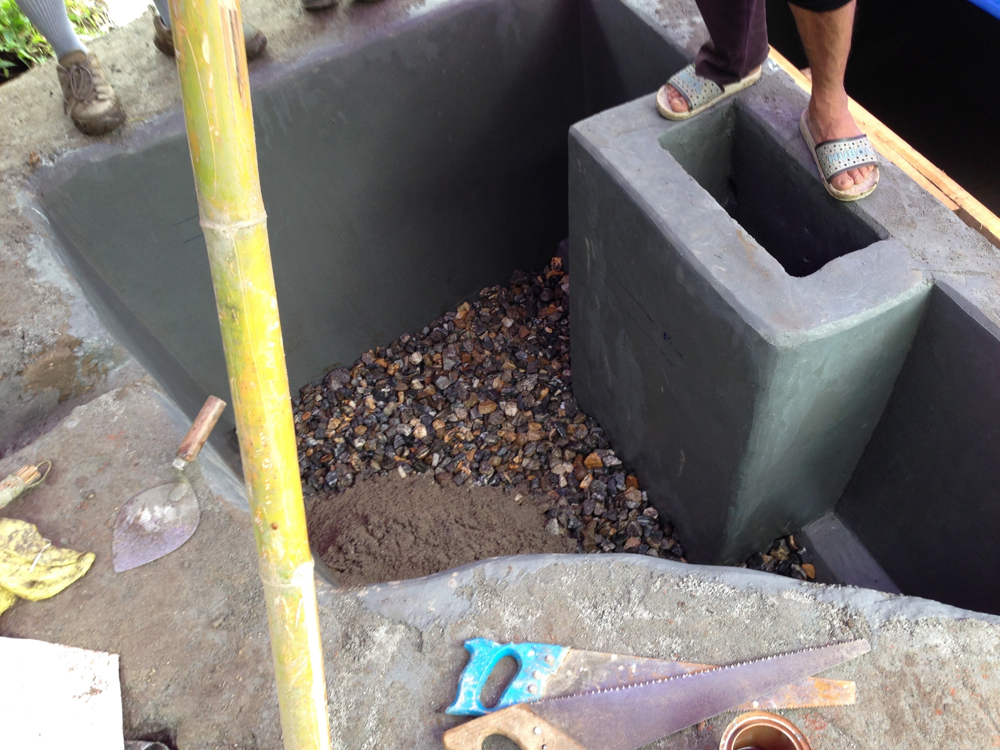
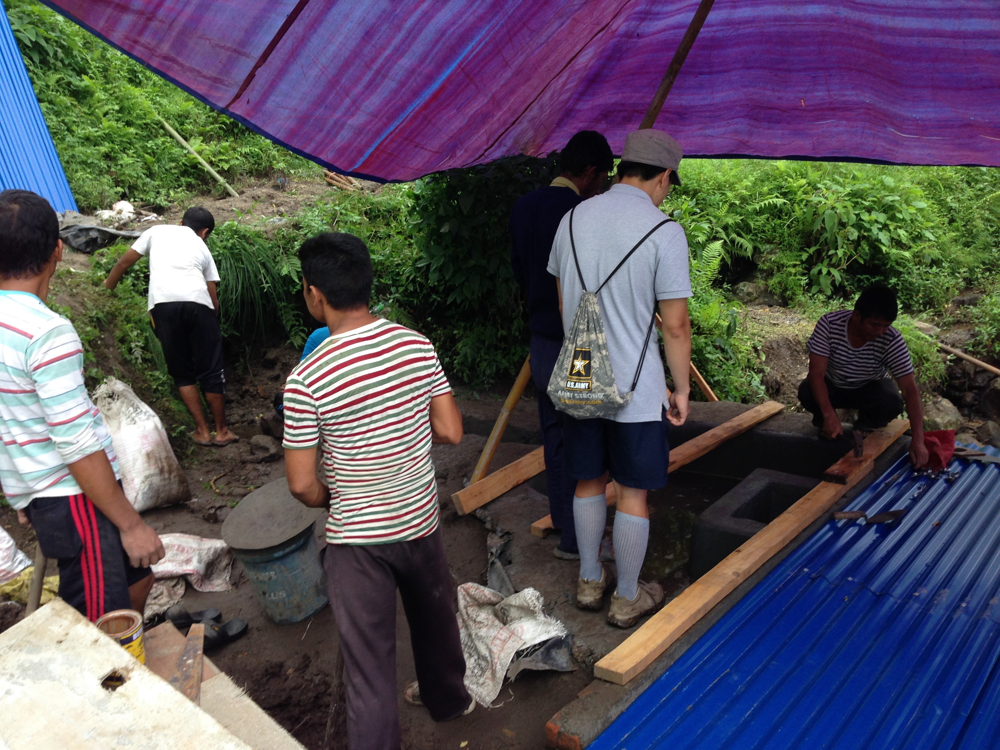
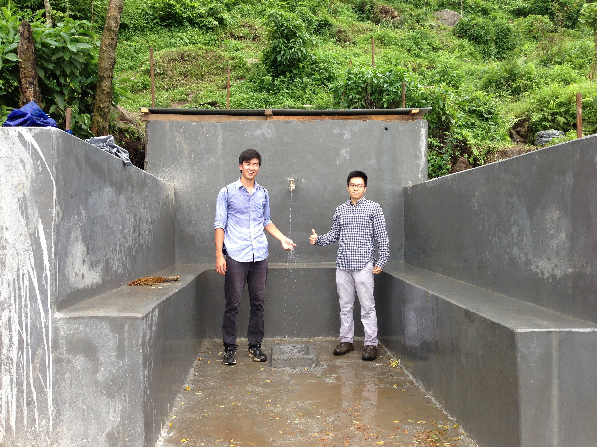
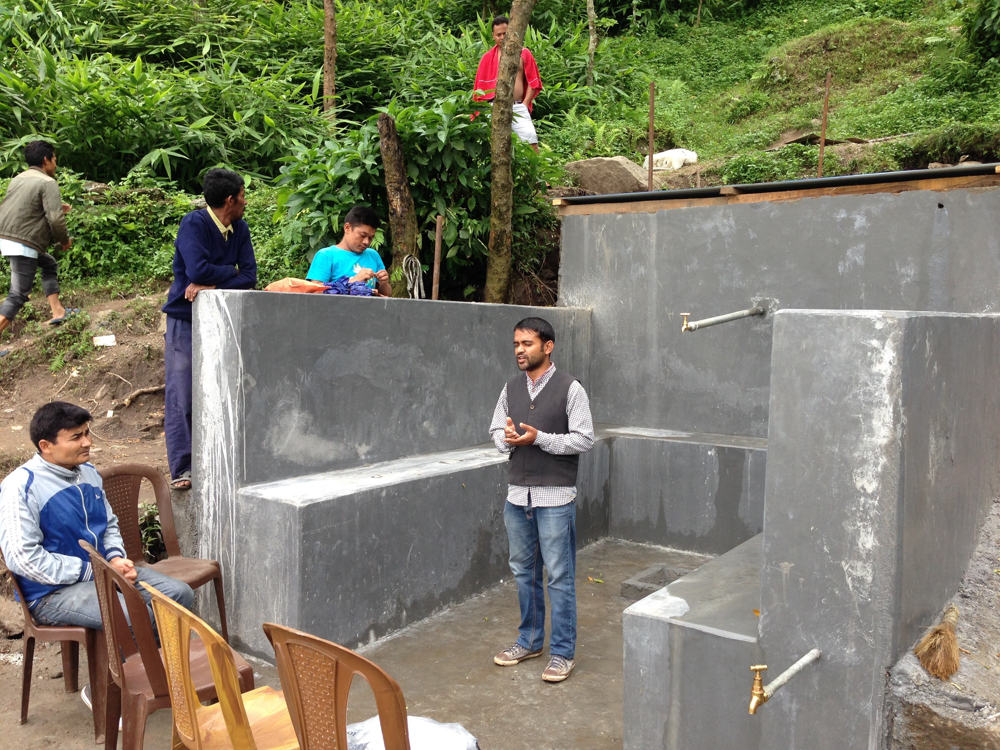
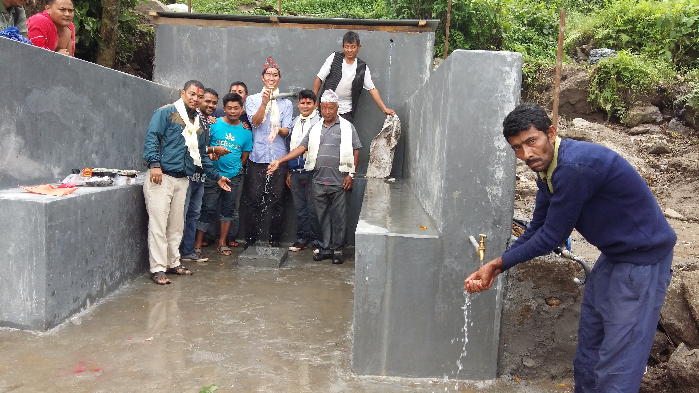

<b> Thukpa, or a Nepalese noodle dish is served as snack at NCDC.</b>

As you may have gathered from the announcement on our Facebook page, we’ve finished the project (save a few minor modifications the community is planning on making). Here’s how the last week went down.

While this past week has been extremely busy (as I will soon explain), we did have some time for more extracurricular activities. We found the tea fields that Ilam is famous for, and close by is the local university (Tribhuvan University). Here, I was able to get my pickup basketball quota for the summer (haven’t played in so long..) by playing with some of the few locals who actually enjoy basketball (it’s mostly football and cricket around here). One of the players owns a pool house nearby as well, and we went over and played our quota of pool for the summer against some of the locals. They’re pretty good, and we’re pretty bad (as an excuse I’ll say rusty), so we lost, unfortunately. Aside from these kinds of sports, at home we entertain Pitu, the 8-year old girl who lives at our homestay, by playing computer games, showing her how to use MS paint, or allowing her to take billions of photos on our smart phones. She has taken a liking to playing us in the card game “war,” and has even shown us the proper way to hand-wash our clothes. Culinarily, we’ve discovered that Shanti makes salsa from Nepali chili peppers that taste eerily like Mexican salsa. Just like all the other dal bhat side dishes she cooks, it’s really tasty.

<b>Jihoon sets up the brick wall that will become the filtered water duct into the reservoir tank. </b>

<b> The filter material is added to the tank. We have a large layer of stones and gravel before 40 cm of sand in our slow sand filter. </b>

<b>The roofs to the reservoir tank and filter tank are built. </b>

 In terms of work on site: upon completion of the reservoir tank, work slowed down immensely as several workers came down with the fever, we had some miscommunications with NCDC and the community, and the rain started pouring in torrentially for hours on end during working hours. To make matters worse, a Maoist strike in the bazaar hampered our ability to get materials for a day. It was already tough enough having to modify measurements and make construction decisions on the fly, but the added time pressure from these delays made it even more difficult. For example, we spent a while convincing both NCDC and the community that using a tin roof for the reservoir would be sufficient, and concrete would be both extremely time consuming and put us over our allowed budget. In addition, the slow-sand filter area had to be completely designed by us during this time based on the topography of the land behind the reservoir tank.

Thus, a July 23 or 24 estimated finish date became a race against the clock to finish by July 28, our last day in Ilam. However, by the skin of our (and the workers’) teeth, the luck of some good weather, and some long work days, we finished the project on July 28. We encountered a close call when we were forced to overhaul our slow-sand filter design on July 27 – some water flow tests in the filter area revealed that the extremely fine sand (one might call it silt) had seeped into our gravel layer and clogged the entrance to the reservoir tank. Morale was not high, but rallying behind us and NCDC engineer Madhu, we worked until sunset excavating and re-filling the filter area with less sand and more rocks to prevent clogging. Upon completing the roofs of both reservoir and filter tanks, we came back the next morning to discover that indeed flow had kept up, and the reservoir tank was rampant with water. While we are calling this a “completion” of the project – as this is true for most intents and purposes – in reality, the workers still have to do minor tasks such as set up a barbed wire fence around the area (to prevent animals and people from damaging the roofs and tanks), and fill the spring flow area with rocks, gravel, plastic, and soil. These are all doable with the remaining materials we have left, and without a great need of our construction oversight.

Because of the completion and our impending departure, a ceremony was held at the spring site on the 28th, although Jihoon was sick with the flu (probably because we worked until sundown the day before perfecting the filter) and thus unable to attend. I was given the ceremonial topi and tikkas, and gave a thank you/farewell speech to the workers, NCDC, and the community on behalf of EWB-Caltech. It was culminated with a ceremonial opening of the taps (see below), and we all (NCDC engineer Madhu, I, and the workers/community members) celebrated at one of the worker’s houses with buffalo meat as well as American chocolates and wine that I brought. We said our farewells to everybody, community and NCDC both, and on the morning of the 29th, we embarked on our long journey back home to the US. Currently, as of me writing this, we are in Kathmandu, awaiting our connecting flight to China.

This project has taught me so much - in both technical and cultural matters. It was sometimes frustrating trying to effectively communicate with the workers and NCDC – there exists somewhat of a language barrier, as well as a cultural barrier, and sometimes work didn’t progress in a day like we would have wanted it to. The contract did not contain half of the design (reservoir tank and filter area were things we needed to design ourselves), and without any construction experience and no contractor to help us, we were more or less on our own with leading construction. But amidst all of these struggles, the workers and we pulled through. Words can’t describe how fast and diligently they worked when they could – we were told by NCDC that a project like this would normally take over three months to complete! We learned about Nepali engineering – a more practical form of engineering a system than sitting down and doing theoretical designing. Many times, we were forced to improvise based on the topography of the land and availability of resources, resulting in creative solutions to making the filter tank (which is trapezoidal, and contains much more gravel and stone than we originally planned). It’s safe to say that Jihoon and I are a lot more seasoned in practical engineering and construction – around here, it’s all about efficiency in cost, time, labor, and materials, and sometimes it isn’t worth making sure that it will withstand a Richter Scale 10 earthquake. (although the tapstand area will, based on how much concrete and steel we used). Of course, it was also a cultural experience for the both of us, as we learned about the language, food, customs, holidays, and people. Overall, this and the rest of my EWB experience has been rewarding, and as an alumnus of the club now, I hope that we graduated members have paved the way for a brighter future for EWB-Caltech, and I’m excited to see what new projects are in store in years to come.

<b>A happy moment for both of us</b>

<b>The ceremony begins with Suman as Master of Ceremonies as the community looks on.</b>

<b>I celebrate the completion of the project with the community and the workers.</b>
