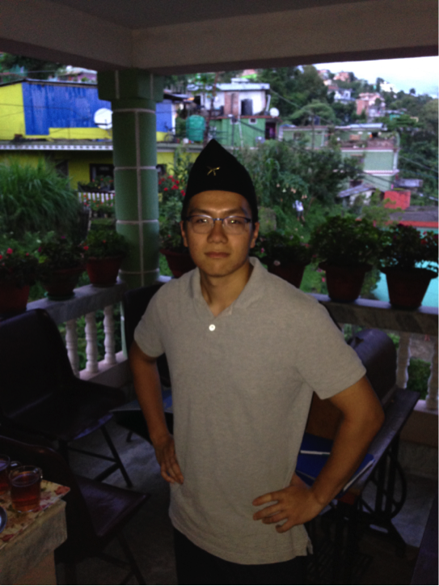
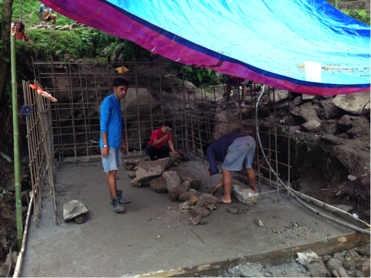
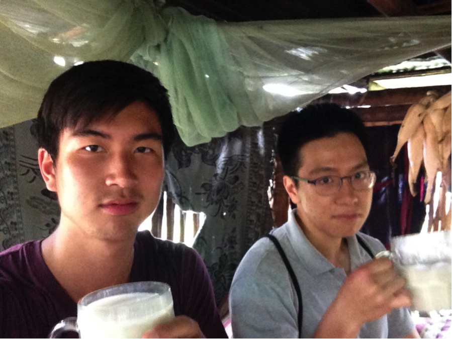

<b> The workers and I. </b>

Jihoon and I have gotten into a fairly daily routine of waking up at 5 AM to the neighbor’s rooster calls, having snacks (usually either cookies, biscuits, or bread with jam) and tea, at 7:30, and then having morning all-you-can-eat dal bhat at around 8:15 AM. The side dishes made by our homestay host and NCDC member Shanti [sic?] have been varied based on the availability of certain vegetables from the garden and the market – they have ranged from pork with pumpkin to potatoes with bitterroot. The meals are quite delicious and varied, and are quite large in quantity. We basically don’t need to eat until our next dal bhat meal at 8 PM. After morning dal bhat, we make the long downhill trek (around 30 minutes) to Bimal Dhara, our spring site, and start working around 9:15 AM with the other workers. Usually we are needed at the site until 5:30 in order to be overseers, field engineers, contractors, skilled laborers, and unskilled workers at the same time. Sometimes when work does not require our contracting, engineering, and physical labor skills, we go to NCDC to discuss and calculate the next steps of the project. At night, we return home from an exhausting 30 minute uphill walk that probably gains 1000m in elevation and are able to admire our 50 additional mosquito and bug bites, none of which hopefully contain Japanese Encephalitis. We have dinner dal bhat at 8 PM, and sleep soon thereafter. Rinse and repeat.

===

<b>Jihoon receives a topi for his birthday from Shanti. </b>

<b>The ground concrete slab has been poured and set, and the rebar has been fixed. </b>

<b>Jihoon and I drink tzhaan [sic], a home-made white rice wine that Bimal (the land owner) provided for us. </b>

 In terms of work at the spring site, if we hit the ground running on the first day of work, then we’ve certainly been sprinting this past week. On the second day of work, we finished soling and started cutting steel rebar for the infrastructure frame. We bent and fixed the rebar in the following two days, and then built a wooden frame and poured in concrete mix for the ground slab. As of my writing this, the stone masonry bench is being completed, and the wooden frame for concrete pouring for the side and back walls of the site is being constructed. Work is progressing fast, and if everything goes well, we should finish earlier than our prescribed July 28 deadline. In the next few days, we will be working on cutting, bending, and fixing the rebar for the frame of the reservoir tank, and pouring concrete for the side and back walls.

In terms of extracurricular life, we have been learning about Nepal and Nepali culture through our interactions with the workers, hosts, and NCDC members. During the work day, the we and the workers take a break from 1-2 PM, during which we go to Suman’s (one of the workers and acts as a translator since his English is very good) house to rest, have tea, and usually some fruit as well. He has been studying Korean for about a year (since apparently a lot of Nepali people end up working in Korea, a lot of people actually study Korean), and Jihoon says it is quite good. From what I’ve seen, he knows a lot of vocabulary words, and can make conversation with Jihoon in Korean, which is really impressive. Sushan, a university student who works at NCDC, has also taught us how to count to ten, which I have been using as a parlor trick to make the locals and the workers laugh. Bimal, the namesake and owner of the land on which the spring site is located, invited us to his house today, where we had fermented lemon and white rice wine, which they seem to love to drink. Shanti even gave Jihoon a topi, which is a cultural Nepalese hat worn at ceremonies and at special occasions (although we’ve seen people wear it around a lot as well), for his birthday, which was yesterday. It has the khukuri emblem, which consists of two crossed Gurkha swords (see pictures). We’ve even learned about the Nepali calendar (it’s year 2073 right now), which has a new year in mid-April and follows some kind of lunar/solar pattern that I can’t discern right now.

All in all, we’ve learned a lot, and accomplished a lot in these past few days. Hopefully we can continue to push forward in this project and continue exploring Ilam and its people and culture in the next few weeks!
