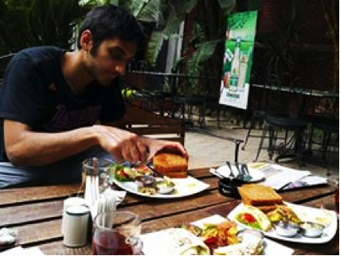
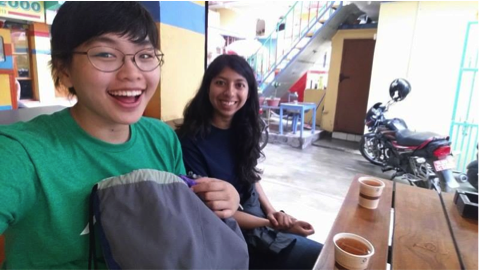
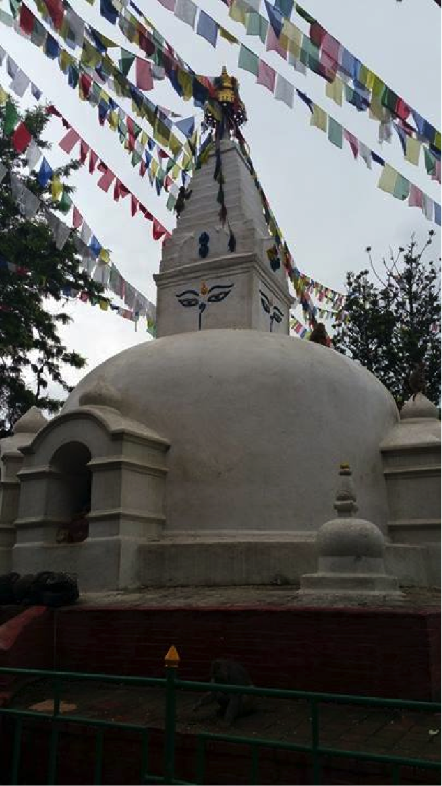
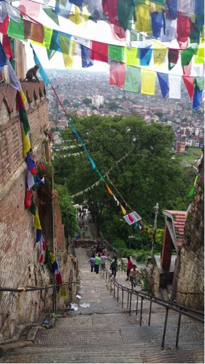
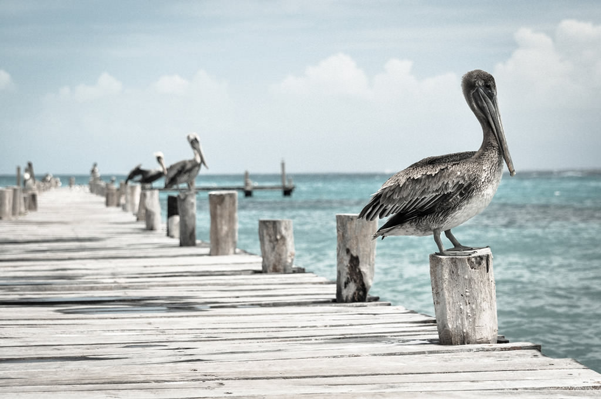
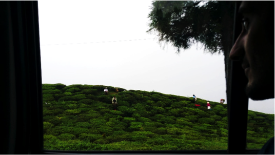
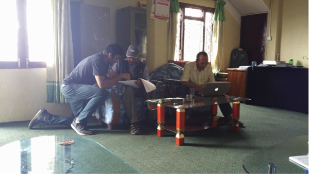
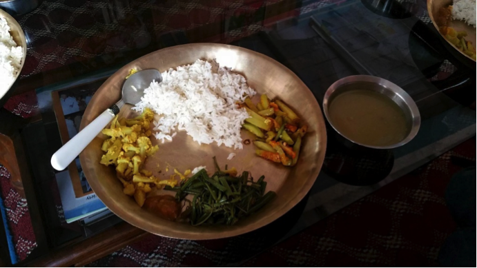
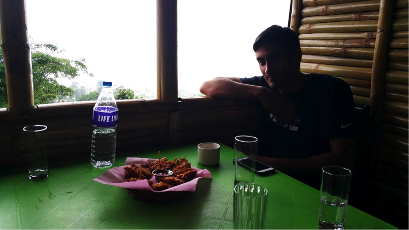
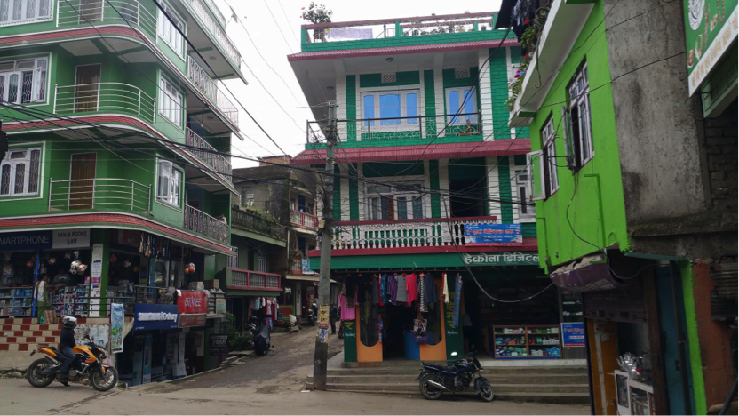

The first shift of EWB-Caltech’s implementation orientation of the spring source protection project arrived in Nepal three days ago, after a 10-hour flight from Chicago to Istanbul followed by a 7-hour flight from Istanbul to Kathmandu. We spent the next day in Kathmandu.

===

<b> Above: Enjoying cake during the layover in Istanbul. </b>
 It’s the rainy season in Nepal, and though it rained in the afternoon, it cleared up enough for us to get local SIM cards (the cell carrier of Nepal is NCell) and do some sightseeing.

We visited the Swayambunath Stupa, known to tourists as the Monkey Temple, which is Kathmandu’s most important Buddha shrine. The name is the “self-created” stupa translated, because according to Buddhist legend, when the temple was founded 2,000 years ago, a single perfect lotus grew in the center of a lake that filled Kathmandu Valley. “When the bodhisattva Manjusri drained the lake with a slash of his sword, the lotus flower settled on top of the hill and magically transformed into the stupa.” Referenced from http://www.sacred-destinations.com/nepal/kathmandu-swayambhunath-stupa

We got to see the monkeys up close, which live in the surrounding forest.

<b> Getting breakfast at Electric Pagoda. </b>

<b>Drinking black tea at BK’s place in Kathmandu. </b>

<b>Monkey Temple.</b>

Near the Swayambunath Stupa, there is Buddha Park, with three huge, golden Buddha statues. “The Statue of the first world peace ambassador Lord Gautama Buddha (height 67 ft) was built by the Tilicho Khangsar Service Committee of Manang District. The foundation stone was laid by Lama Sherep Gyaljen on 21/6/1999 and completed on 9/8/2002”, from the sign in front of the statues.

The next morning, we took a 1-hour flight to Bhadrapur, from which we took a Jeep up a mountain for two hours to finally reach Ilam. Ilam means “winding way”, and that sure is accurate! We took a never-ending amount of turns up a mountain to get to our host Kaji’s house.

After a great meal of dal bhat (Nepali lentil soup and rice, the national dish of Nepal) and vegetables [picture] and a good night’s sleep, we went to NCDC today to meet with its members and discuss the logistics and feasibility of our spring protection project. We also met members of the EWB CU-Boulder team, who have been in Nepal for four weeks. Afterward, Aryan guided us to a lookout with an amazing view of the entire region of Ilam.

We also stopped by a local restaurant and got some veggie pakoda, which are fried veggie patties. Then we walked back down into the bazaar and picked up some wire mesh for making our demonstration filter column, which we’ll fill with sand and gravel to make a small slow-sand filter similar to our actual protection system.

Some of the things I’ve discovered about Nepal:

- Out of 365 traffic lights in Kathmandu, only 5 work, and we saw none of them. Also, pedestrians share the road with cars and motorcycles (not that surprising) but the system of stopping when you’re about to hit someone works surprisingly well. Also, when there are lane markers, they appear to be mostly a recommendation depending on how many people are on the road at the time. There have been some tight spots where I thought the road was too narrow, but the driver successfully maneuvered through.
- There are many wild dogs and cats, and chickens, cows, goats, and other farm animals roam around everywhere. This may sound weird and self-centered, but I’m not used to getting ignored by dogs.
- There are routine power outages, and the wifi is a fickle mistress.
- We drink tea at every opportunity. Ilam is one of Nepal’s major tea producers, and Ilam tea is especially good because it has a bit of a spice to it. [picture of tea fields] Nauman is a huge fan of tea, and no matter how hot the tea is, he can usually suck it down within minutes.
- We drink tea at every opportunity. Ilam is one of Nepal’s major tea producers, and Ilam tea is especially good because it has a bit of a spice to it. [picture of tea fields] Nauman is a huge fan of tea, and no matter how hot the tea is, he can usually suck it down within minutes.
- It is very, very humid and I am getting used to being moist all the time.
- Since we are in the mountains, there is not a lot of flat land, so we’re usually walking up or down hills. What people in America call hiking is really just walking here.
- The landscapes of Nepal are beautiful and the food is delicious. We’re looking forward to starting our school program and construction on the spring source protection system soon!

<b>Three Buddha statues. </b>

<b>Nauman, thinking about the view or his impending motion sickness. The farmers are tending to tea crops. </b>

<b>Inside NCDC.</b>

<b>Yummy!</b>

<b>Aryan pointing out the amazing view to Nauman.</b>

<b>Pakoda and Nauman.</b>

<b> A street view of the bazaar </b>
