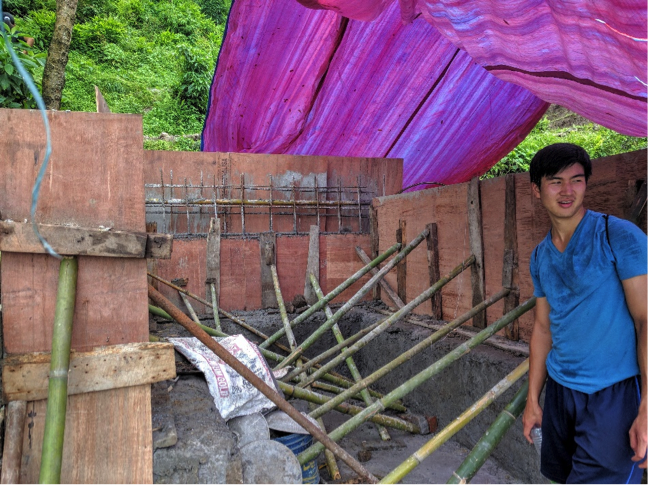

<b>In our role as desk engineers, figuring out where to place rebar for the water tank. </b>

<b>Like our first 80 hours of our journey to and in Nepal, the past two weeks have been a real whirlwind.</b>

Our fast but deliberate and careful construction sprint has continued, made all the more exciting because of our constantly jam-packed role as field engineer-desk engineer (occasionally)-overseer-contractor-skilled/unskilled laborers. Over the past week, we shaped and placed rebar, then poured concrete to form almost all of our walls and the water storage tank. Now, for the remaining week that we have here, we have to complete and test the structure for the filter, add filter media, place lids on top of the storage tank and filter, add finishing to the concrete as needed, and cover the upstream area to prevent contamination. The workers, and Madhu from NCDC, told me that some people like to throw random things in water storage tanks around town for fun – so far among the artifacts found were lone shoes, beer bottles, even a dead dog. To help prevent this and keep our water pure, we’ll also have to create a barbed wire fence along the perimeter of the tank and the filter. We were also discussing making heavier water tank and filter lids to make them harder to access, but we decided that the fence with our current ideas for the lids would be sufficient. We hope to finish everything by this Sunday, July 24, which an estimate that one of the senior workers gave me. We’re going to have as many workers as we can get to help out. I have to give lots of credit to all the workers – they’ve been very hard working, despite the heavy rain around us and their many other commitments including farming and, for one of them, working at a hydropower plant in the evenings.

<b>In our role as unskilled laborers, excavating space to be used for the slow sand filter.</b>

<b>Webster after admiring the glorious formwork for the side and rear walls. The formwork has since been removed and reused for creating the water tank.</b>

<b>The completed water tank, viewed from the rear of the system. The tank collected some delicious stormwater overnight after some heavy rains because it is not yet covered. Its capacity is about 2200 L.  </b>

<b>Farmers are planting rice around our construction site. They plant rice in mid/late July, then harvest in early December. Some of the workers were busy with this for some time as well. </b>

<b>Integrating into local society a la a certain Coldplay music video</b>

 One of our biggest fears during our time here during construction has been of falling ill, since that has the potential to eliminate our meaningful presence here. One of our workers today couldn’t show up because of a fever (which led to a slowdown in work today), and Webster was suffering slightly from lethargy and headache for a bit a few days ago. To our relief, we learned that the mosquito-borne diseases that we feared most, i.e. malaria, Japanese Encephalitis, and Dengue fever, only really occurred a little south of us, in the Terai region of Nepal (southern plains), so at least we don’t have to worry about those as much now.

After construction completes, we will do some water testing and train locals in operation and maintenance (O&M, as EWB-USA mandates) before formally handing over the spring source protection system to the Bimal Dhara community.

Outside the work site, we’ve slightly broadened our interactions with people in Ilam. We played karambol, which is a game similar to pool but notably uses flat pucks instead of balls, finger flicks instead of sticks, and a smaller table. It was fun, but the regulars laughed at us for being terrible players. Unfortunately, we didn’t have time afterwards for a montage sequence of us practicing, after which we would have beat even the toughest locals and became the foreigner celebrities that won the hearts of everybody in Ilam in a happy ending. We remain terrible. Aside from that, we’ve met a variety of people around town that seem to enjoy conversing with us. To my surprise still, many people talk to me in Korean after realizing that I’m Korean because they have worked or plan to find work in Korea. Webster also met a jolly tour guide who wants him to teach him some Chinese.

The next few days will be a burst of activity again as we spring across the last stretch of our implementation. We look forward very much to have this project completed so that we have time to be off-site for the few (presumably a few, and not zero) days we would have remaining after we finish.
