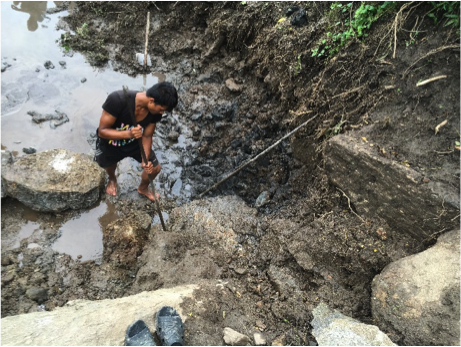
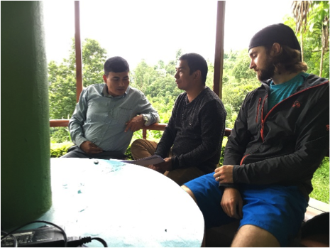

<b>Matt calibrating an auto level in order to accurately verify excavation depth. </b>

The last few days of winding up first shift have been somewhat stressful, since we are trying to prepare for the handover to Jihoon and Webster. Although we had originally envisioned much of the concrete work to have already been completed by this time, we were forced to significantly redesign much of the system upon arrival due to the difficulty of excavating certain rocks and because the community wanted to downsize the project. Most of first shift was thus spent overseeing excavation and renegotiating all of the contracts and designs with NCDC and the community. This entailed redoing all of the structural calculations, making detailed materials and cost estimates, and constructing material acquisition and financing schemes to facilitate project progress. 3 days before team 1 arrival, the massive contract and each of its 25 pages were signed by EWB-Caltech, NCDC, and the Bimal Dhara user committee. Changing the designs and remaking the contract were an excellent learning experience for the entire team. Though we spent months finalizing designs in the states based on our detailed assessment trip, a 2 year old trip and a couple of pictures cannot replace the value of observing the on- ground reality of what the site we wanted to develop is actually like. Only by starting to dig did we realize that certain parts of the system would have to be moved or rescaled to fit the position of the natural bed rock. Moreover, although it was easy for Matt to redo the structural calculations given the adjusted designs, it was much more difficult to explain to the community why such a large amount of steel or such a large concrete pad was necessary to ensure proper wall strength and stability. In the end, regardless of what our team or NCDC feels is necessary for the system, the community must be convinced of its utility in order for them to fully own the system and for the project to be ultimately successful.

<b>Community worker displacing a large rock. The unskilled laborers, which consisted of community members who devoted their time and labor to the project, worked extremely hard. The excavation required strenuous stone breaking and shoveling. </b>

<b>Contract signing day with community user Arun, NCDC engineer Madhu, and Matt.</b>
