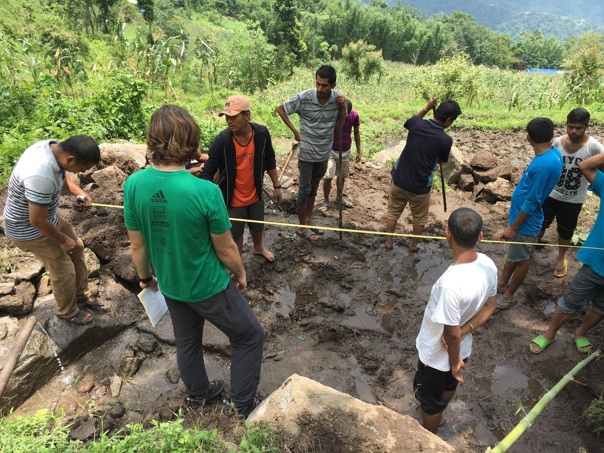

<b>An additional point</b>

Speaking of things locals are casual about, they’re also amazing at hiking (heretofore referred to as walking, because, as mentioned earlier, that is what it is here). As opposed to Americans getting in their minivans and driving to a national park, here walking up and down steep, unpaved hills is a fact of life, not a choice to be made while wearing custom Patagonia fleeces. Stray dogs and children both will pass us by as we struggle on the narrow dirt paths. Also, despite the 90% humidity and 80-85 degree heat, the locals don’t seem to sweat and we regularly see women with flawless makeup pass us as we heave uphill with our dripping faces.

On the education side of the project, we visited our first school today: Satyanarayan primary, which is a government funded school, as opposed to a private school. Ilam is a wealthier part of Nepal, so government funded schools are typically small and full of very poor students, as the rich families opt for private schooling. Additionally, government schools are rarely “English medium” like many private schools, where all the classes except Nepali are taught in English. We even heard a story about a tax for speaking Nepali of 5-10 rupees at an English medium private school! Satyanarayan has 29 students enrolled from grades one through five, and when we visited, 17 were present. Though it’s a small four-room building, the school is managed very well by teachers and a principal who care a lot about their students. The snack budget for the school comes out of their own salary, which is very small for a government teacher. We showed the students bacterial plates grown from Bimal Dhara (our spring site), a slow-sand filter that we built, and a hand washing demonstration with the goal of encouraging water safety and sanitation. The language barrier would have been insurmountable, but Sushan from NCDC was a very adept translator, though he did make us take some ridiculously steep, slippery shortcuts to get to the school. We dream of sidewalks.

<b>Jack fruit, khichiri, and momos</b>

Despite not being fans of walking, we love the food here! We eat fresh mangoes and other assorted fruits with nearly every meal. We tried jackfruit, which looks like large garlic cloves and tastes kind of like a chewy banana. Some other stuff we’ve eaten: khichiri (an Indian rice and lentil porridge), aloo paratha, a mashed potato stuffed flatbread that tastes even better than it sounds, homemade momos, which are Nepalese dumplings, and snack food at NCDC like nimki subzhi, a fried dough in potato and lentil stew. We also drink 3-4 cups of Ilam tea a day, which is normally black with a lot of a sugar and some spice, though sometimes we have it with milk. Because boiled water is always safe, we frequently drink tea to hydrate, and tea is always offered if you’re sitting somewhere more than 10 minutes.

We all have been picking up some Nepali, especially Katherine after she got a lesson from Rina, our host Kaji’s wife (and Ronik’s mom). We try it out sometimes on Nepalese people, but they often just speak English back.Here are some phrases we’ve learned:
Meru naam ____ ho: My name is ____.
Tapaiiko nam ke ho: What is your name?
Tapaii lai kosta cha: How are you?
Malai rambra cha: I’m good.
Dan ya bhaad: Thank you.

We are easing up on our use of dan ya bhaad, because culturally Americans and thank you are like Canadians and sorry: we say it so much it loses meaning. When we visited the school, the principal thanked us and NCDC for coming, but then when we thanked her for letting us visit for our program, she looked very confused and our translator explained “No, she’s thanking YOU”. Also, when we say “thank you” we don’t get a response (there’s no Nepali equivalent for you’re welcome.) Here’s an [interesting article on “thank you”]("https://www.theatlantic.com/international/archive/2015/06/thank-you-culture-india-america/395069/") in southeast Asia.

We’re looking forward to continuing work on the spring source protection system and the education plan. Stick with us for more updates on them, the food, Anushka’s fall total (right now it’s 8!), the amount of times Katherine has screamed at wildlife (5?), and the amount of times Nauman has anxiously gasped after getting checked in chess (3).
