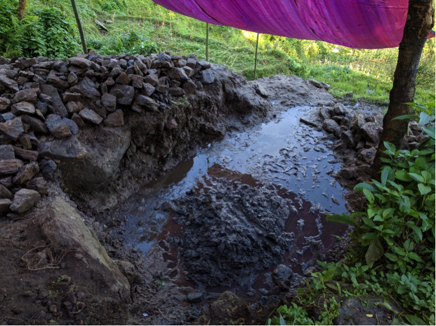
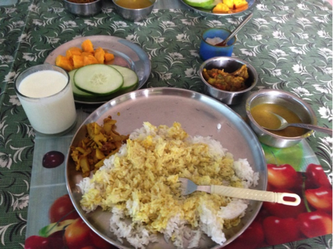
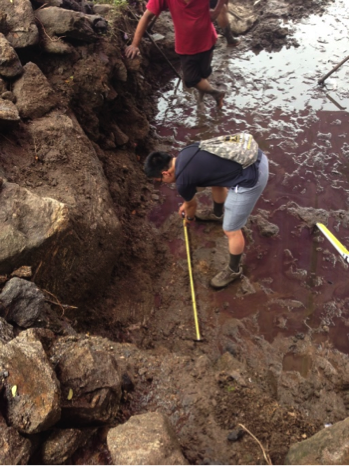
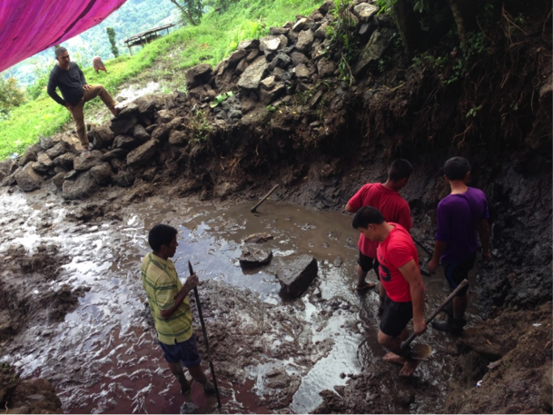

<b>Jihoon and Webster being welcomed in NCDC offices upon arrival, right before a detailed meeting with first shift. No rest for the weary </b>

The past 80 hours were a real whirlwind! It’s only now that I have enough time to write an update. I started out from Seattle’s SeaTac airport, flew down to LAX to rendezvous with Webster to form the second shift group, then together had to catch a series of four flights and a jeep ride to Ilam. In the ensuing frenzy, I lost my laptop charger and faced a near-crippling flight delay that had the potential to delay our arrival by a whole two days. We got to Ilam successfully and on time, though, and got to enjoy a day of rest in Kathmandu.

Right after arriving, Webster and I met with the intrepid first shift group and the legendary NCDC staff members at NCDC’s headquarters to get a detailed review on the Bimal Dhara project’s status and remaining tasks. This included a review of community agreements and design revisions and a tour of the implementation site. Site excavation was close to completion by then, thanks to the hard work of Mr. Bimal Shrestha’s community workers. We are optimistic that we will finish implementation by the deadline of July 28th, which is the day before we have to return to Kathmandu so that we can catch our return flights to the US, and we will put all our efforts into reaching that goal.

<b>An overview of the implementation area on transition day. To the left with higher elevation will be the water filtration/protection and storage area. The center will be the wash basin area. In the very center is a layer of excavated clay, which has since been cleared. The smaller rocks on the top of the excavation area will be used for laying foundation bedding. </b>

[blog3_6](blog3_6.png)

<b>Jihoon about to enjoy his first homestay dal bhat. </b>

<b>A closeup of Webster’s dal bhat from the same meal, accompanied with muy (a sort of curdled milk) and mango slices.</b>

Today, we hit the ground running and continued from where the first shift left off. We and the construction team completed excavation and, after verifying that it was done to specifications, began arranging the stone bed that forms our design’s foundation. This is expected to be done by tomorrow, after which concrete formwork will be constructed in preparation for concrete pouring and molding on top of the stone bed. This will involve setting up steel rebar, which we expect to receive and cut/bend to our specifications tomorrow, suspended on a temporary wooden frame. I’m pretty interested in seeing how this will look – the rebar network in our design is quite dense and crisscrossed. To ensure that the rebar arrangement will go as planned, we looked over and verified its design at the office.

Back at the homestay, I’m looking forward to the progress we plan to make tomorrow. Once the concrete slab is poured in and set, the rest of the construction should proceed relatively smoothly so I look forward to that as well. Hopefully temperatures stay as cool and rains stay as light and occasional as they are now so that construction goes uninterrupted. Yahoo!

<b>Jihoon measuring excavation dimensions</b>

<b>Finishing up excavation. The soil below the foundation is currently waterlogged – a testament to the Bimal Dhara spring’s great flow.</b>
